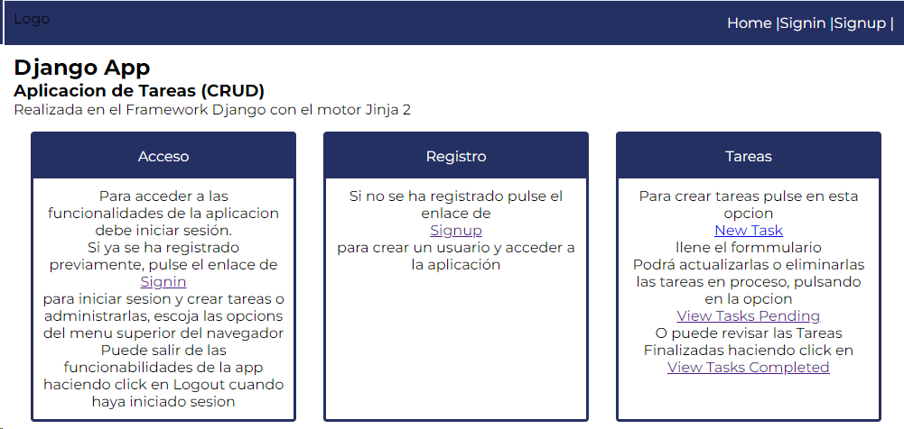
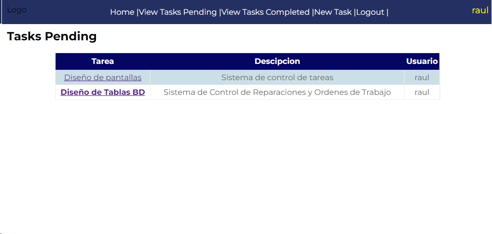
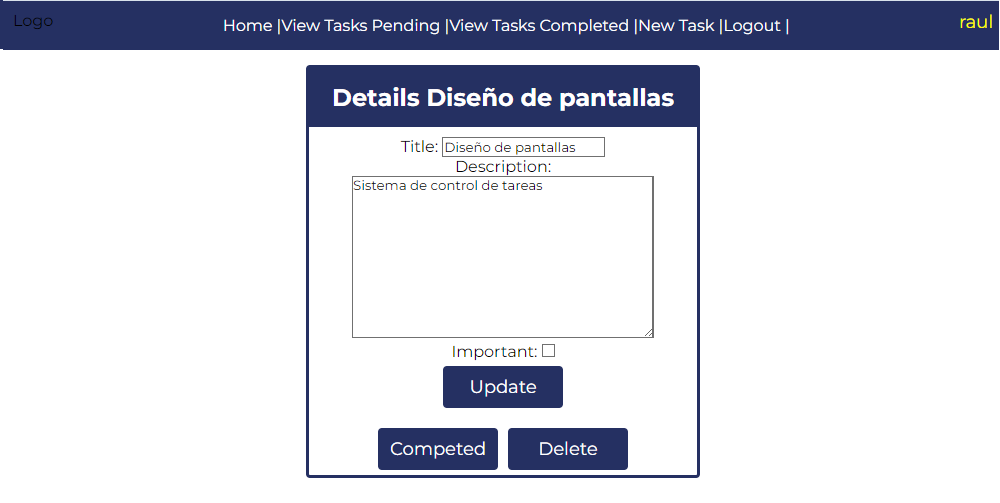

## Aplicación de Administracion de Tareas 

Crud de Registro de Tareas para administración de actividades
Utiliza un sistema de sesiones mediante Loggeo para poder acceder
a las opciones de Creación, Actualizacion, Borrado de datos. 

**Nota:** *Para la creacion de los usuarios debe registrarse por medio de Django-Admin*

| BackEnd | FrontEnd | Repositorio de Datos |
|-|-|-|
| Django  | Jinja, Html y CSS | SQLite3 |

---

Paqueteria Utilizada en Django

| Paquete | Versión |
|-|-| 
| Django | 4.2.5 |

---

---

|Raúl Ibáñez M.|
|-------------------------|   
